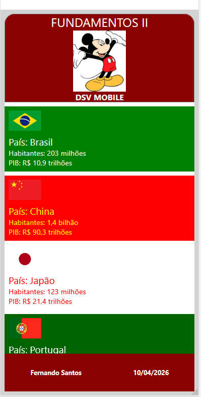

<h1 align="center">App de Países - Componentização (Desafio 03)</h1>

<p align="center">
  <a href="#-atividade">Atividade</a>&nbsp;&nbsp;&nbsp;|&nbsp;&nbsp;&nbsp;
  <a href="#descrição-do-projeto">Descrição do Projeto</a>&nbsp;&nbsp;&nbsp;|&nbsp;&nbsp;&nbsp;
  <a href="#estrutura-do-projeto">Estrutura do Projeto</a>&nbsp;&nbsp;&nbsp;|&nbsp;&nbsp;&nbsp;
  <a href="#-tecnologias">Tecnologias</a>&nbsp;&nbsp;&nbsp;|&nbsp;&nbsp;&nbsp;
  <a href="#-layout-do-app">Layout do App</a>&nbsp;&nbsp;&nbsp;|&nbsp;&nbsp;&nbsp;
  <a href="#exemplo-de-uso">Exemplo de Uso</a>&nbsp;&nbsp;&nbsp;|&nbsp;&nbsp;&nbsp;
  <a href="#-feito-por">Feito por</a>
</p>

<br>

<a href="https://github.com/Ncgrande">
  
</a>

---

## ✅ Atividade

<p align="justify">
Desenvolvimento de um aplicativo mobile utilizando React Native com foco em componentização, onde foram passados parâmetros (props) entre componentes para exibir informações personalizadas.
</p>

---

## 📋 Descrição do Projeto

O aplicativo foi desenvolvido utilizando componentes reutilizáveis:

### 🔹 Componentes utilizados:
- **Cabecalho**
  - Recebe uma imagem por parâmetro

- **Conteudo**
  - Recebe:
    - Imagem da bandeira
    - Número de habitantes
    - PIB

- **Rodape**
  - Recebe:
    - Nome
    - Data

---

## 📂 Estrutura do Projeto


```
├── App.js
├── print.png
├── src/
│ ├── Cabecalho.js
│ ├── Conteudo.js
│ ├── Rodape.js
│ ├── Item.js
│ └── styleSheet/
│ └── estilos.js
├── img/
│ └── imagens dos países
├── README.md
```

---

## 🚀 Tecnologias

- React Native
- Expo
- JavaScript
- Node.js

---

## 📱 Layout do App

<p align="center">
  
</p>


---

## 💻 Exemplo de Uso


1. Instalar as dependências:
```
npm install
```

2. Iniciar o projeto:

```
npx expo start
```


3. Abrir no celular com o **Expo Go**

---

## 🎯 Conceitos aplicados

- Componentização
- Reutilização de componentes
- Uso de **props**
- Organização de pastas
- Separação de estilos

---

## 👽 Feito por

Estudante do 5º semestre de Análise e Desenvolvimento de Sistemas:

- **Nilson Grande**
